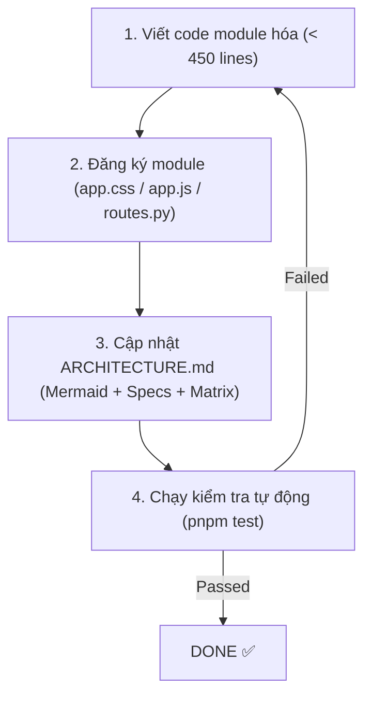

# AGENTS.md — AI Agent Guidance & Operating Protocols

This document defines the operating rules, architectural boundaries, and verification checklists for AI coding agents (Antigravity, Claude Code, Cursor, Windsurf, Aider, etc.) working on **Obsidian QuickView**.

---

## 1. Project Philosophy & Constraints

1. **Lightweight & Fast**: Obsidian vault viewer/editor running locally with Python 3.12 standard library, SQLite FTS5, and Native browser ES Modules.
2. **Zero External Runtime Dependencies**: No npm runtime dependencies, no build bundlers (Webpack/Vite) at runtime.
3. **Strict Modularity & Low Context Footprint**: Every module is bounded (< 450 lines of code) with single responsibility.
4. **Backward Compatibility**: `bin/obs-view`, root `server.py`, root `indexer.py`, and existing HTTP JSON APIs must never break.

---

## 2. Context-Minimized Development Protocol

> [!CAUTION]
> **DO NOT read all files in the repository into your context window.** Doing so wastes tokens, pollutes reasoning, and risks introducing unintended side effects.

### Step 1: Locate your Feature Scope
Always open [ARCHITECTURE.md](file:///home/huy/mygit/obsidian-quickview/ARCHITECTURE.md) and check **Section 5: Feature-to-File Matrix** (`Bảng Tra Cứu Tính Năng → Tệp`).

### Step 2: Read & Edit ONLY Allowed Files
For each of the 10 core features, the matrix defines:
- **Tệp Cho Phép Đọc & Sửa** (Allowed Files)
- **DOM Elements / Classes Liên Quan** (Associated DOM targets)
- **Backend File** (Associated Backend service)
- **Tệp CẤM Đọc/Sửa** (Excluded Files — do not touch!)

### Step 3: Zero Cross-DOM Mutation
- Never manipulate another component's DOM elements directly.
- Communication between components must go through:
  - `eventBus.emit('eventName', payload)` ([static/js/events.js](file:///home/huy/mygit/obsidian-quickview/static/js/events.js))
  - `appState` reactive properties ([static/js/state.js](file:///home/huy/mygit/obsidian-quickview/static/js/state.js))

---

## 3. Definition of Done (DoD) for New Features / Refactors

Whenever an AI Agent implements a new feature or refactors an existing one, **the agent is NOT finished until all 4 criteria below are met**:



### 1. Module Size Cap (< 450 lines)
- New logic belongs in dedicated files in `core/`, `static/js/`, or `static/css/`.
- Do not dump hundreds of lines into existing files.

### 2. Module Registration
- **CSS**: Add `@import 'css/<name>.css';` in `static/app.css`.
- **JS**: Add ES `import` in `static/js/app.js` or the relevant parent module.
- **Backend**: Register endpoints in `core/routes.py` if new HTTP routes are created.

### 3. Architecture Documentation Sync
You **MUST** update [ARCHITECTURE.md](file:///home/huy/mygit/obsidian-quickview/ARCHITECTURE.md):
- Add any new module/file to the **Mermaid architecture diagram** (Section 3).
- Add the class/functions to the **Module Specification table** (Section 4).
- Add the feature to the **Feature-to-File Matrix** (Section 5).

### 4. Automated Verification
Run the architecture linter and test suite:
```bash
pnpm test
```
This runs:
1. `node tests/test_render_markdown.js` (Markdown/LaTeX rendering tests)
2. `python3 -m unittest discover tests` (Python unit tests)
3. `python3 scripts/check_architecture.py` (Architecture and doc coverage linter)

If `scripts/check_architecture.py` reports any file missing from `ARCHITECTURE.md` or any file exceeding the line limit, **fix the documentation and code immediately**.

---

## 4. Quick Command Reference

```bash
# Run all tests (including architecture linter)
pnpm test

# Check only architecture & doc sync
pnpm test:arch
# or
python3 scripts/check_architecture.py

# Run Markdown / LaTeX tests
pnpm test:markdown

# Run Python tests
python3 -m unittest discover tests
```
