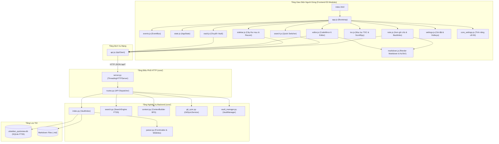

# Kiến Trúc Hệ Thống & Bộ Quy Tắc Phát Triển (ARCHITECTURE.md)

Tài liệu này cung cấp bản đồ kiến trúc toàn diện của **Obsidian QuickView**, đặc tả ranh giới đối tượng, phương thức và **Bộ quy tắc phát triển dành cho Lập trình viên & AI Agent** nhằm đảm bảo nguyên tắc: *khi thêm/sửa một tính năng bất kỳ, chỉ đọc và thao tác đúng các tệp liên quan, tuyệt đối không nạp các tệp không ảnh hưởng vào Context*.

---

## 1. Triết Lý & Nguyên Tắc Kiến Trúc (Core Principles)

1. **Zero External Runtime Bloat**:
   - Backend chỉ sử dụng thư viện chuẩn của Python (`http.server`, `sqlite3`, `subprocess`, `urllib`). Không dùng framework nặng (Flask, FastAPI, Django). Bộ nhớ chiếm dụng < 20MB RAM, phản hồi sub-millisecond.
   - Frontend sử dụng Native Web Standards (ES Modules `type="module"`, CSS Variables, vanilla DOM). Không build-step (trừ CodeMirror 6 prebundle), không cài đặt Vite/Webpack khi chạy.
2. **High Cohesion & Loose Coupling (Gắn kết cao, Phụ thuộc lỏng)**:
   - Mỗi file đảm nhiệm đúng một trách nhiệm duy nhất (Single Responsibility Principle) và không vượt quá 350-450 dòng mã.
   - Các UI Component không bao giờ trực tiếp thao tác DOM của nhau; mọi tương tác liên thành phần đi qua **`EventBus`** hoặc **`AppState`**.
3. **Unidirectional Dependency Flow (Luồng phụ thuộc một chiều)**:
   - `UI Component` → `AppState / ApiClient` → `HTTP Endpoints` → `Domain Services` → `SQLite / FileSystem`.
   - Tuyệt đối không có phụ thuộc vòng (no cyclic dependencies).

---

## 2. Sơ Đồ Cấu Trúc Thư Mục (Directory Layout)

```
obsidian-quickview/
├── bin/
│   └── obs-view               # Bash CLI entry point: start/stop/status daemon, open browser
├── install.sh                 # Cài đặt, tự động build lại toàn bộ assets & restart server
├── uninstall.sh               # Gỡ bỏ toàn bộ dịch vụ, phím tắt Desktop và dọn dẹp cache
├── server.py                  # CLI Python launcher (accepts port & vault args) → core/server.py
├── indexer.py                 # Backward-compatibility export adapter → core/
├── core/                      # Backend Service & HTTP Layer (Python 3.12)
│   ├── __init__.py            # Re-exports core domain interfaces
│   ├── config.py              # Constants & default configurations
│   ├── parser.py              # Frontmatter, tags, wikilinks, diacritics parsing
│   ├── search.py              # SearchEngine: SQLite FTS5 search engine
│   ├── index.py               # VaultIndex: SQLite schema, incremental scanning, note resolution
│   ├── context.py             # ContextBuilder: BFS knowledge graph, ASCII tree, Mermaid, LLM prompt
│   ├── git_sync.py            # GitSyncService: Git status, commit, pull, push
│   ├── vault_manager.py       # VaultManager: Config persistence, auto-discovery, active vault
│   ├── routes.py              # Modular HTTP route handlers (GET/POST /api/*)
│   └── server.py              # Lightweight HTTP Server & static file streaming
├── static/                    # Frontend Single Page Application
│   ├── index.html             # Shell layout with semantic containers & DOM IDs
│   ├── app.css                # Master CSS manifest (imports modular stylesheets via @import)
│   ├── css/                   # Modular Stylesheets
│   │   ├── variables.css      # CSS variables, color palettes, dark & light themes
│   │   ├── base.css           # Reset, body layout, scrollbars, common buttons, modal backdrop
│   │   ├── sidebar.css        # Left sidebar, folder tree, recent list, tags
│   │   ├── note.css           # Note view layout, breadcrumbs, action toolbar, frontmatter, backlinks
│   │   ├── markdown.css       # Rendered markdown typography, callouts, tables, KaTeX math
│   │   ├── toc.css            # Right sidebar TOC outline panel, heading highlight pulse
│   │   ├── editor.css         # CodeMirror 6 live preview, source mode, split view, stats
│   │   ├── live-preview.css   # Live preview decoration engine styles, callouts, tables, checkboxes
│   │   ├── search.css         # Search modal, tabs, input box, result list, keyword mark
│   │   ├── modals.css         # Vault picker modal, settings modal, hotkeys table, snippet dialog
│   │   └── core-settings.css  # Switch slider & layout cho toggle tính năng cốt lõi
│   ├── js/                    # Native ES Modules
│   │   ├── events.js          # EventEmitter & global eventBus (PubSub)
│   │   ├── state.js           # AppState: reactive central state & navigation history
│   │   ├── icons.js           # Reusable SVG icon templates
│   │   ├── api.js             # ApiClient: typed HTTP wrappers for /api/*
│   │   ├── markdown.js        # Markdown parser, KaTeX math lazy-loading & LaTeX renderer
│   │   ├── toc.js             # TocController: Outline generator & ScrollSpy
│   │   ├── editor.js          # EditorController: CodeMirror 6 wrapper & Live/Split/Preview modes
│   │   ├── hotkeys.js         # HotkeysManager: Key normalization, conflict detection, snippets
│   │   ├── search.js          # SearchModalController: Quick Switcher modal & keyboard navigation
│   │   ├── sidebar.js         # SidebarController: Tree view, recent notes, tags
│   │   ├── note.js            # NoteViewerController: Note loading, frontmatter, backlinks, copy actions
│   │   ├── vault.js           # VaultModalController: Vault cards, switcher, custom path adding
│   │   ├── settings.js        # SettingsModalController: Theme toggle, language switcher, hotkeys UI
│   │   ├── core_settings.js   # CoreSettingsController: Bật tắt Folders, Recent, Tags, Outline
│   │   └── app.js             # Main bootstrap orchestrator
│   ├── i18n.js                # I18n runtime engine (loads JSON locales)
│   ├── locales/               # vi.json, en.json
│   └── (build artifacts)     # cm6-bundle, marked, highlight, katex sinh tự động bởi scripts/build.js
├── scripts/
│   ├── build.js               # Đóng gói CM6, Highlight.js, Marked, KaTeX từ devDependencies
│   ├── build-cm6.js           # Build CodeMirror 6 bundle riêng biệt
│   └── check_architecture.py  # Bộ linter kiểm tra tính tuân thủ kiến trúc và độ dài tệp
└── tests/
    ├── test_indexer.py        # Python unit tests for indexing, parser, backlinks
    ├── test_vault_manager.py  # Python unit tests for vault config & switching
    └── test_render_markdown.js # Node.js unit tests for Markdown, callouts, LaTeX, embeds
```

---

## 3. Sơ Đồ Luồng Hoạt Động (Architecture Flow & Mermaid Diagram)



---

## 4. Đặc Tả Đối Tượng & Phương Thức (Object Contracts & Public APIs)

### 4.1. Frontend Modules (`static/js/`)

| Module / Class | Trách Nhiệm Chính | Các Phương Thức Public & Sự Kiện (Contract) |
|---|---|---|
| **`EventEmitter`** (`events.js`) | Hộp thư PubSub điều phối sự kiện | `on(event, handler)`, `off(event, handler)`, `emit(event, data)`, `once(event, handler)` |
| **`AppState`** (`state.js`) | Trạng thái ứng dụng & Navigation History | `setTheme(theme)`, `setEditMode(mode)`, `setTocOpen(open)`, `setCurrentNote(note)`, `setIsEditing(bool)`, `setVaultInfo(...)`, `pushHistory(path)`, `goBack()`, `goForward()` |
| **`ApiClient`** (`api.js`) | Giao tiếp HTTP với backend | `fetchNote(path)`, `saveNote(path, content)`, `searchNotes(q, mode, limit)`, `fetchContext(path, depth)`, `resolveTarget(target)`, `openAttachment(path)`, `fetchTree()`, `fetchTags()`, `switchVault(path)`, `syncGit()` |
| **`MarkdownRenderer`** (`markdown.js`) | Chuyển đổi Markdown và công thức toán | `renderMarkdown(rawMd, currentNotePath, marked, katex, renderLatex)`<br>`renderLatex(latex, isBlock, katex)`<br>`loadKatex()` |
| **`NoteViewerController`** (`note.js`) | Màn hình hiển thị Note, Breadcrumb, Backlinks | `loadNote(path, pushHistory)`<br>`renderNote(noteData)`<br>`copyMarkdown()`, `copyContext()`, `syncVault()`, `openObsidian()` |
| **`EditorController`** (`editor.js`) | CodeMirror 6, Live Preview, Mode switching | `startEditing()`, `cancelEditing()`, `save()`<br>`setMode(mode: 'live'\|'source'\|'split'\|'preview')`<br>`insertSnippet(text)`, `updateStats(text)`, `updateLivePreview()` |
| **`TocController`** (`toc.js`) | Mục lục tiêu đề (Outline), phân cấp collapse & ScrollSpy | `generate()`, `scheduleUpdate()`, `updateActiveItem()`, `toggleCollapseAll()`, `applyState(open)` |
| **`SearchModalController`** (`search.js`) | Quick Switcher tìm kiếm tiêu đề & nội dung | `open(query, mode: 'title'\|'content')`, `close()`, `setMode(mode)`, `search(query)` |
| **`SidebarController`** (`sidebar.js`) | Cây thư mục, ghi chú gần đây, tags | `loadAll()`, `loadTree()`, `loadRecent()`, `loadTags()`, `addRecentNote(note)`, `toggle()` |
| **`VaultModalController`** (`vault.js`) | Hộp thoại chọn và chuyển đổi vault | `open(isMandatory, title, desc)`, `close()`, `checkStatus()`, `switchVault(path)`, `addCustomVault()` |
| **`SettingsModalController`** (`settings.js`) | Cài đặt theme, i18n, phím tắt & snippets | `open()`, `close()`, `setSubtab(tab)`, `renderHotkeys()`, `renderSnippets()`, `startRecording(type, id)` |
| **`CoreSettingsController`** (`core_settings.js`) | Bật/tắt các tính năng cốt lõi (Folders, Recent, Tags, Outline) | `init()`, `syncUI()` |
| **`HotkeysManager`** (`hotkeys.js`) | Chuẩn hóa phím tắt, phát hiện xung đột | `normalizeKeyComboFromEvent(e)`, `findHotkeyConflict(combo, type, id)`, `registerActionHandler(id, fn)` |

### 4.2. Backend Modules (`core/`)

| Module / Class | Trách Nhiệm Chính | Các Phương Thức Public & Chữ Ký Hàm |
|---|---|---|
| **`VaultIndex`** (`core/index.py`) | Quản lý schema SQLite, quét file & index | `update_index(force: bool = False) -> Dict[str, int]`<br>`get_note_by_path(rel_path: str) -> Optional[Dict]`<br>`resolve_target(target_title: str) -> Optional[str]`<br>`get_tree() -> Dict`<br>`get_tags() -> List[Dict]`<br>`get_note_context(path, depth) -> Dict` |
| **`ContextBuilder`** (`core/context.py`) | Thu thập đồ thị tri thức đa tầng cho LLM | `build_context(vault_index, root_path: str, max_depth: int = 1) -> Optional[Dict]`<br>`build_tree_ascii(notes_dict) -> str`<br>`format_relative_time(mtime: float) -> str` |
| **`GitSyncService`** (`core/git_sync.py`) | Đồng bộ Git (commit, pull, push an toàn) | `sync_vault(vault_path: str) -> Dict[str, Any]`<br>`is_git_repo(vault_path: str) -> bool` |
| **`SearchEngine`** (`core/search.py`) | Thuật toán tìm kiếm SQLite FTS5 | `search(query: str, mode: str, limit: int) -> List[Dict]`<br>`search_title(query: str, limit: int)`<br>`search_content(query: str, limit: int)` |
| **`VaultManager`** (`core/vault_manager.py`) | Quản lý cấu hình & phát hiện vaults | `load_vault_config() -> Dict`<br>`save_vault_config(...)`<br>`get_all_vaults(active_path) -> List[Dict]`<br>`get_active_vault_path() -> Tuple[str, bool, bool]`<br>`get_vault_db_path(vault_path) -> str` |
| **`Routes`** (`core/routes.py`) | Điều phối các HTTP API Endpoints | `handle_get_route(path, query, vault_index) -> Tuple[int, Dict]`<br>`handle_post_route(path, body, vault_index, on_switch) -> Tuple[int, Dict]` |
| **`Server`** (`core/server.py`) | Khởi chạy server & stream static/vault file | `run_server(vault_path, port, host)`<br>`ObsidianViewHandler` (kế thừa `BaseHTTPRequestHandler`) |

---

## 5. Bảng Tra Cứu Tính Năng → Tệp (Feature-to-File Matrix)

> [!IMPORTANT]
> **Quy tắc bắt buộc đối với Lập trình viên & AI Agent:**
> Khi nhận yêu cầu sửa lỗi hoặc phát triển một tính năng thuộc cột **"Tính Năng / Nhiệm Vụ"**, bạn **CHỈ ĐƯỢC PHÉP ĐỌC VÀ SỬA** các tệp nằm trong cột **"Tệp Cho Phép Đọc & Sửa"**. Tuyệt đối không đọc các tệp trong cột **"Tệp CẤM Đọc/Sửa"** để bảo vệ context window và ngăn ngừa lỗi lan truyền.

| Tính Năng / Nhiệm Vụ | Tệp Cho Phép Đọc & Sửa | DOM Elements / Classes Liên Quan | Backend File (Nếu có) | Tệp CẤM Đọc/Sửa (Out of Scope) |
|---|---|---|---|---|
| **1. Tìm kiếm nhanh (Quick Switcher Search)** | `static/js/search.js`<br>`static/css/search.css` | `#search-modal-backdrop`<br>`#search-input`<br>`#search-results`<br>`.search-mode-tab` | `core/search.py`<br>`core/routes.py` (chỉ hàm `handle_api_search`) | `static/js/editor.js`<br>`static/js/markdown.js`<br>`core/git_sync.py`<br>`core/context.py` |
| **2. Trình soạn thảo (CodeMirror 6, Live Preview, Split View, Stats)** | `static/js/editor.js`<br>`static/css/editor.css`<br>`static/css/live-preview.css` | `#edit-container`<br>`#cm-editor-mount`<br>`#edit-preview-body`<br>`.btn-mode-tab`<br>`#edit-stats` | `core/routes.py` (chỉ hàm `handle_api_save`) | `static/js/search.js`<br>`static/js/vault.js`<br>`core/git_sync.py`<br>`core/context.py` |
| **3. Render Markdown, KaTeX & Công thức toán** | `static/js/markdown.js`<br>`static/css/markdown.css`<br>`tests/test_render_markdown.js` | `.markdown-body`<br>`.math-block`<br>`.math-inline`<br>`.callout`<br>`.wikilink` | `core/parser.py` | `static/js/vault.js`<br>`static/js/settings.js`<br>`core/git_sync.py`<br>`core/server.py` |
| **4. Mục lục Outline (TOC) & ScrollSpy** | `static/js/toc.js`<br>`static/css/toc.css` | `#sidebar-right`<br>`#toc-list`<br>`#toc-count-badge`<br>`#btn-collapse-all-toc`<br>`.toc-node`<br>`.toc-item`<br>`.heading-highlight` | *Không liên quan backend* | `core/*`<br>`static/js/vault.js`<br>`static/js/search.js` |
| **5. Cây thư mục (Tree), Ghi chú gần đây, Tags** | `static/js/sidebar.js`<br>`static/css/sidebar.css` | `#sidebar`<br>`#pane-tree`<br>`#pane-recent`<br>`#pane-tags`<br>`.file-item`<br>`.recent-item` | `core/index.py` (hàm `get_tree`, `get_tags`) | `static/js/editor.js`<br>`static/js/markdown.js`<br>`core/git_sync.py` |
| **6. Giao diện xem ghi chú (Breadcrumbs, Frontmatter, Backlinks)** | `static/js/note.js`<br>`static/css/note.css` | `#note-container`<br>`#note-breadcrumb`<br>`#note-frontmatter`<br>`#note-backlinks`<br>`.btn-copy-link` | `core/routes.py` (hàm `handle_api_note`)<br>`core/index.py` | `static/js/settings.js`<br>`static/js/vault.js`<br>`core/git_sync.py` |
| **7. Quản lý & Chuyển đổi Vault (Vault Switcher)** | `static/js/vault.js`<br>`static/css/modals.css` (khối vault) | `#vault-modal-backdrop`<br>`#vault-items-list`<br>`#btn-vault-switcher`<br>`.vault-card` | `core/vault_manager.py`<br>`core/routes.py` (hàm `handle_api_vaults`) | `static/js/markdown.js`<br>`static/js/editor.js`<br>`core/context.py`<br>`core/git_sync.py` |
| **8. Cài đặt Giao diện, Ngôn ngữ, Hotkeys, Snippets & Core Settings** | `static/js/settings.js`<br>`static/js/core_settings.js`<br>`static/js/hotkeys.js`<br>`static/css/modals.css` (khối settings)<br>`static/css/core-settings.css` | `#settings-modal-backdrop`<br>`.settings-lang-card`<br>`#hotkeys-buttons-list`<br>`#snippet-dialog-backdrop`<br>`#settings-pane-core`<br>`#toggle-core-*` | *Lưu trữ trên localStorage* | `core/*`<br>`static/js/markdown.js`<br>`static/js/editor.js` |
| **9. Tổng hợp Knowledge Context cho LLM** | `static/js/note.js` (nút Copy Context)<br>`core/context.py` | `#btn-copy-context`<br>`#context-dropdown-menu` | `core/context.py`<br>`core/routes.py` (hàm `handle_api_context`) | `static/js/editor.js`<br>`static/js/vault.js`<br>`core/git_sync.py` |
| **10. Đồng bộ Git Vault (Git Sync)** | `static/js/note.js` (nút Sync Vault)<br>`core/git_sync.py` | `#btn-sync-vault` | `core/git_sync.py`<br>`core/routes.py` (hàm `handle_api_git_sync`) | `static/js/markdown.js`<br>`static/js/toc.js`<br>`core/search.py`<br>`core/context.py` |

---

## 6. Bộ Quy Tắc Phát Triển Cho Agent & Người Phát Triển (Agent Rules & Protocol)

### Quy tắc 1: Phạm vi Tính năng Tối thiểu (Bounded Feature Scope)
- Khi bắt đầu một task (thêm tính năng hoặc fix bug), bắt buộc phải tra cứu bảng **Feature-to-File Matrix** ở Mục 5.
- Chỉ mở đúng các tệp trong cột **Tệp Cho Phép Đọc & Sửa**. Tuyệt đối không dùng lệnh `grep` hay `find` quét lung tung ngoài phạm vi khi không cần thiết.

### Quy tắc 2: Giới hạn Kích thước Tệp & Trách nhiệm (Size & Responsibility Cap)
- Mỗi tệp `.js`, `.css`, `.py` không được vượt quá **400 dòng mã**.
- Nếu một tính năng mới làm một file vượt quá 400 dòng, lập tức tách thành sub-module chuyên biệt và liên kết qua `import` / `export`.

### Quy tắc 3: Cấm Thọc Trực Tiếp Vào DOM Của Component Khác (Zero Cross-DOM Mutation)
- Không component nào được phép can thiệp trực tiếp vào phần tử DOM nội bộ của component khác (ví dụ: `editor.js` không được tự ý sửa DOM của `#toc-list` hay `#tree-container`).
- Giao tiếp giữa các component bắt buộc phải đi qua **`eventBus.emit('event:name', data)`** hoặc cập nhật trạng thái trong **`appState`**.

### Quy tắc 4: Bảo Toàn Tương Thích Ngược (Zero Breaking Changes)
- Mọi API route (`/api/*`) phải giữ nguyên hợp đồng JSON trả về.
- `bin/obs-view`, root `server.py`, và root `indexer.py` phải luôn hoạt động bình thường mà không cần thay đổi cách gọi lệnh.

### Quy tắc 5: Khuôn Mẫu Prompt Chuẩn Khi Giao Việc Cho Agent (Agent Prompt Protocol)
Khi bạn hoặc người khác yêu cầu AI Agent (Claude Code, Gemini, Antigravity, Cursor, v.v.) thực hiện nhiệm vụ, hãy sao chép mẫu prompt chuẩn sau:

````markdown
[TASK]: <Mô tả chức năng cần thêm hoặc sửa>
[FEATURE_SCOPE]: <Chọn 1 trong 10 tính năng trong bảng Feature-to-File Matrix>
[ALLOWED_FILES]: 
- <Danh sách tệp theo bảng Feature-to-File Matrix>
[EXCLUDED_FILES]:
- <Danh sách tệp bị cấm theo bảng Feature-to-File Matrix>
[RULE]: Chỉ đọc và sửa các tệp trong [ALLOWED_FILES]. Tuân thủ nguyên tắc EventBus và AppState trong ARCHITECTURE.md.
````

**Ví dụ thực tế**:
````markdown
[TASK]: Sửa lỗi highlight từ khóa khi tìm kiếm ghi chú bằng FTS5
[FEATURE_SCOPE]: 1. Tìm kiếm nhanh (Quick Switcher Search)
[ALLOWED_FILES]:
- static/js/search.js
- static/css/search.css
- core/search.py
- core/routes.py
[EXCLUDED_FILES]:
- static/js/editor.js, static/js/markdown.js, core/git_sync.py, core/context.py
[RULE]: Chỉ đọc và sửa các tệp trong [ALLOWED_FILES]. Không thay đổi cấu trúc của các module khác.
````

### Quy tắc 6: Tiêu Chuẩn Hoàn Thành Bắt Buộc (Definition of Done - DoD for Agents)
Mọi AI Agent hoặc lập trình viên khi thêm tính năng mới hoặc chỉnh sửa cấu trúc **BẮT BUỘC** phải tuân thủ checklist sau trước khi kết thúc task:

1. **Phân rã module (< 450 dòng)**:
   - File mới phải được đặt đúng thư mục (`core/`, `static/js/`, `static/css/`).
   - Không được nhồi nhét tính năng mới vào các file đã lớn.
2. **Đăng ký liên kết**:
   - CSS: Khai báo `@import 'css/<file>.css';` trong `static/app.css`.
   - JS: Khai báo `import` trong `static/js/app.js` hoặc module cha tương ứng.
   - Python: Đăng ký endpoint trong `core/routes.py` nếu có API mới.
3. **Cập nhật `ARCHITECTURE.md`**:
   - Thêm node/luồng vào sơ đồ Mermaid (Mục 3).
   - Thêm dòng vào Bảng Trách nhiệm Module (Mục 4).
   - Thêm tính năng và danh sách tệp vào bảng **Feature-to-File Matrix** (Mục 5).
4. **Chạy kiểm tra tự động**:
   - Chạy lệnh: `pnpm test:arch` (hoặc `python3 scripts/check_architecture.py`).
   - Lệnh kiểm tra này tự động xác minh:
     - 100% tệp trong `core/`, `static/js/`, `static/css/` đều phải xuất hiện trong `ARCHITECTURE.md`.
     - Không tệp nào vượt quá giới hạn dòng quy định.
   - Chạy toàn bộ test: `pnpm test`.
   - **Nhiệm vụ chỉ được coi là hoàn thành (DONE) khi `pnpm test` đạt 100% PASSED.**

